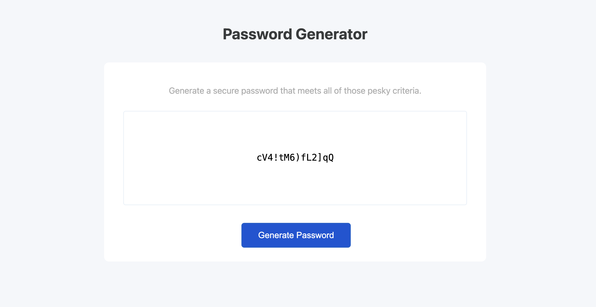

# A Secure Password Generator 🔒

A password generator that generates a password based on the user's input - saving time when a password has to fulfill multiple different requirements.

# Description

I want to be able to generate a secure random password that meets certain criteria so that I can create a strong password that provides greater security.

The generator will provide a password that meets the following criteria:

- User can choose the length of their password (between 8 and 128 characters)
- User can choose whether to include lowercase letters
- User can choose whether to include uppercase letters
- User can choose whether to include numbers
- User can choose whether to include special characters

To ensure a secure password:

- If the user chooses a length outside of the range, a random number between 8 and 128 will be chosen for them
- Validataion is performed to ensure that at least one character type is selected

## Usage

The deployed site can be found [here](https://annabrisland.github.io/password-generator).

## Credits

N/A

## License

[MIT](https://choosealicense.com/licenses/mit/)